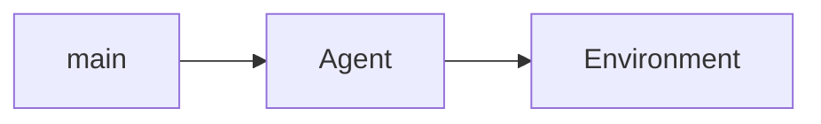
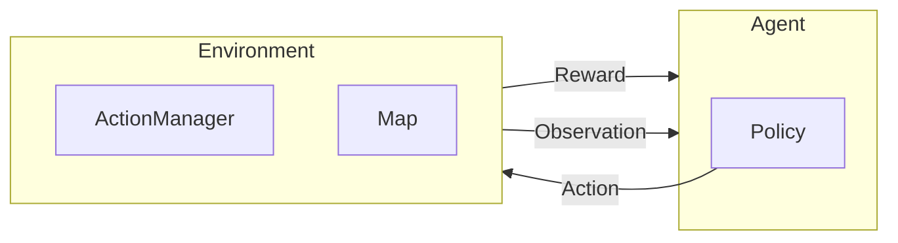

# setup

if both repos are only local
```bash
pip install -e /path/to/other/repo
```

# Civ Sim

## Game Rules

### Claiming tiles
- a tile can only be claimed if it is visible
- a tile can only be claimed if it is not already claimed
- a tile can only be claimed if it is adjacent to a claimed tile or a building not including roads and bridges

### Buildings
#### Roads
- must be placed on an already self claimed tile
- or next to another building including roads and bridges
- only placeable on: normal Land, Dessert and Marsh

#### Bridge
- must be placed on an already self claimed tile
- or next to another building including roads and bridges
  - only placeable on: normal Ocean and River

#### City
- can only be placed on a visible or already self claimed tiles
- placing a city claims the tile
- only placeable on: normal Land, Dessert and Marsh

#### Farm
- can only be placed on an already self claimed tile
- only placeable on: normal Land and Marsh

#### Mine
- can only be placed on an already self claimed tile
- only placable on Mountain or resource

### Land Types
- normal Land
- Mountain
- Dessert
- Marsh
- Ocean

### Resources
#### Grain
- only on Land and Marsh tiles
- doubles Farm output

#### Metall
- only on Mountain tiles
- doubles Mine output


# API
## Environment

### Attributes
- env_settings (Dict[str, Any]): A dictionary containing environment-specific settings.
- num_agents (int): The number of agents present in the environment.
- render_mode (str): The mode for rendering the environment. Options:
  - 'human': Renders the environment to the screen.
  - 'rgb_array': Returns an RGB array of the current frame.
- seed (Optional[int]): Seed for the environment's random number generator, ensuring reproducibility.
- screen_width (int): Width of the rendering screen (default: 1000).
- screen_height (int): Height of the rendering screen (default: 1000).
- screen: The pygame screen object used for rendering.
- map: Represents the grid-based map of the environment.
- agents (List[Agent]): A list of agent instances present in the environment.
- action_manager (ActionManager): Manages and applies actions from agents.
- action_mapping: Placeholder for action mappings (implementation-specific).
- observation_space: Defines the space of possible observations.
- action_space: Defines the space of possible actions.

### Initialization
`__init__(env_settings, num_agents, render_mode='rgb_array', seed=None)`
Initializes the MapEnvironment.

Parameters:
- env_settings (Any): Configuration settings for the environment.
- num_agents (int): Number of agents in the environment.
- render_mode (str, optional): Rendering mode ('human' or 'rgb_array'). Default is 'rgb_array'.
- seed (Optional[int], optional): Seed for random number generation. Default is None.

Raises:
- ValueError: If env_settings is not a dictionary.
- ValueError: If num_agents is not an integer.
- ValueError: If render_mode is not 'human' or 'rgb_array'.
- ValueError: If seed is provided but is not an integer.

### `reset(seed=None, map_file=None)`
Resets the environment to its initial state and returns the initial observations.

Parameters:
- seed (Optional[int], optional): Seed for random number generation. If provided, it ensures reproducibility.
- map_file (Optional[str], optional): Path to a file defining the map topology. If provided, the map is created based on the file's topology.

Returns:
- Tuple[observations, info]:
- observations: Initial observations for all agents.
- info (Dict): Additional information (currently contains a placeholder).

Raises:
- ValueError: If seed is provided but is not an integer.

### `step(actions)`
Executes a step in the environment by applying actions from all agents and updating the environment state.
Dimension 1: List of agents.
Dimension 2: List of actions per agent.
Dimension 3: Action parameters ([action_id, x, y]).

Parameters:
- actions (List[List[List[int]]]): A 3D list of integers representing actions.

Returns:
- Tuple[observations, rewards, dones, truncated, info]:
- observations: Updated observations for all agents.
- rewards: Rewards received by each agent.
- dones: Flags indicating whether each agent has finished.
- truncated: Flags indicating whether each agent's episode was truncated.
- info (Dict): Additional information (currently empty).

Raises:
- ValueError: If actions is not a 3D list of integers.
- ValueError: If each individual action does not consist of exactly three integers.

### `render()`
Renders the current state of the environment.

Behavior:
`env.render_mode == "human"` mode:
Updates the pygame display.
Prints the money and last money PL of the first agent.
`env.render_mode == "rgb_array"` mode:
Updates the pygame display.
Returns an RGB array representing the current frame.

Returns:
Optional[np.ndarray]: The RGB array if render_mode is 'rgb_array', otherwise None.

Raises:
- NotImplementedError: If an unknown render_mode is specified.

 
### `close()`
Closes the environment and performs necessary cleanup.

Behavior:
- Quits the pygame instance to free up resources.
- return the initial observation of the newly setup environment. and a info


# TODO

## RL Setup
- [ ] Integrartion with PufferLib?
- [ ] Optimized for RL, Cython?, JAX?


## Utils
- [ ] write profiler script for memory and time for different map sizes and agent counts-> write to a file/ table, maybe markdown?
- [ ] map previewer for a map topology file, with matplotlib

## Map
- [ ] extend map generator script to create maps of different settings
- [ ] create some maps with different sizes and different land type and resource distributions
  - [ ] add some resources

- graph representation of roads

- make importance editable water over mountain over dessert
-  enable distribution method
-  make the distribution density and type editable
- add river water adjacent type, based on perlin noise with meandering
- enable actual biomes
- make height relevant for water and mountain
- loading maps into env


## RL
- [ ] make some kind of run setup to run on the different maps of different settings and logg

### Observation
- [ ] different types of observability for different agents
- [ ] adjust height, biomes and other min and max values in obs space
  - [ ] add option for continuos map
- [ ]!! define when done or truncated

### Rewards
- [ ] calculate rewards better, decide what rewards to give
- [ ] money for farm and mine on standard field or on resource
- [ ] setup reward structure around 0 with standard deviation of 1, is supposed to be better for learning


### Actions
- [ ] account for continuous maps in action checks
- [ ] roads on mountain possible but expensive

## UI
- [ ] zooming, moving?
- [ ] Better Game termination log, why did it terminate?, which round?

- [ ] better logging for other agents, what actions they choose
- [ ] City ID connected to city owner?


## Dev Ops
- [ ] move stuff to cython
- [ ] optimize for GPU, cuda
- [ ] add more tests, increase coverage
- [ ] add more scenario tests
- [ ] scaling tests, on predefined test map, small and large scale, by map size and agent count
- [ ] documentation!!
- [ ] think about package API access, which attributes of env and which methods, funcitons, objects should be accessible

## Far fetched
- [ ] tech tree, some actions only possible if reached a level
- [ ] Population
- [ ] Tech tree
- [ ] Units
- [ ] Diplomacy
- [ ] Combat

# Mind Map





# Resources

## interesting tools and repos

* https://terrain.party/
* https://godotengine.org/asset-library/asset/1913
* https://github.com/Mindwerks/plate-tectonics
* https://github.com/Mindwerks/worldengine
* https://github.com/jessvb/3D_world_procedural_generation_GAN/blob/master/README.md
* http://www-cs-students.stanford.edu/~amitp/game-programming/polygon-map-generation/
* https://www.redblobgames.com/maps/mapgen4/
* https://www.redblobgames.com/x/1929-voronoi-percolation/

### intersting research
* https://www.instructables.com/Converting-Map-Height-Data-Into-3D-Tiles/
* https://www.mit.edu/~jessicav/6.S198/Blog_Post/ProceduralGeneration.html

## coding tools

* https://neptune.ai/blog/tensorboard-tutorial

# Bugs

- [ ] if bug with pyopengl for rendering you might need to do this: https://programmersought.com/article/82837518484/
- [ ] if error with rendering accessing the libGL error MESA-LOADER  failed to open iris driver try this command 'conda install -c conda-forge libstdcxx-ng', more info here: https://stackoverflow.com/questions/72110384/libgl-error-mesa-loader-failed-to-open-iris
-
