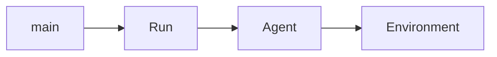
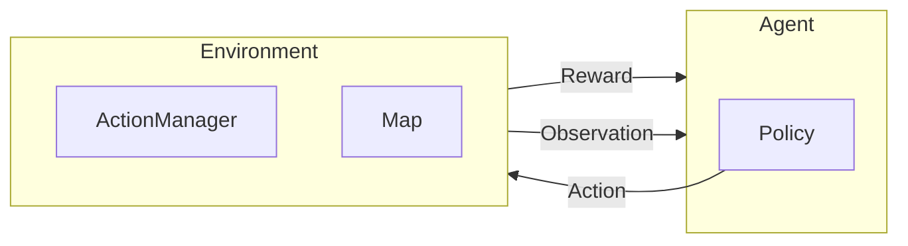

# Civ Sim


## TODO

### Game
- [ ] Population
- [ ] Tech tree
- [ ] Buildings
- [ ] Units
- [ ] Diplomacy
- [ ] Combat
- [ ] continuous map?

### RL Setup
- [ ] Integrartion with PufferLib
- [ ] Optimized for RL, Cython?
- [ ] restructure project setup


## Code quality

### pre-commit

This project uses [pre-commit](https://pre-commit.com/) to enforce code quality.
It must be executed manually!

```bash
pre-commit run -a
```

### TF logs
clear TF logs
run TF board

```bash
tensorboard --logdir logs
```
### time profiling

```bash
python -m cProfile -o output.prof main.py
snakeviz output.prof
```

| tiles | sim_map.create_map | map_square.draw |
|-------|--------------------|-----------------|
| 10    | 0.000              | 0.000           |
| 10^2  | 0.000              | 0.000           |
| 10^3  | 0.000              | 0.000           |
| 10^4  | 0.000              | 0.000           |
| 10^5  | 0.000              | 0.000           |
| 10^6  | 23.6               | 9.08            |
| 10^9  | 0.000              | 0.000           |
### memory profiling

add the following to the functions you want to profile

```python
from memory_profiler import profile
@profile
def your_function():
    pass
```

run the script with the following command
```bash
python -m memory_profiler your_script.py
```

| memory | spike 1 | spike_2 |
|--------|---------|---------|
| 10     | 0.000   | 0.000   |
| 10^2   | 0.000   | 0.000   |
| 10^3   | 0.000   | 0.000   |
| 10^4   | 0.000   | 0.000   |
| 10^5   | 0.000   | 0.000   |
| 10^6   | 23.6    | 9.08    |
| 10^9   | 0.000   | 0.000   |

# Game Rules

## Buildings
### Roads
- can on be started on a claimed tile
- if tile not claimed it must be next to another road

### Bridge
- can on be started on a claimed tile
- if tile not claimed it must be next to another road

### City
- can only be placed on a visible tile
- placing a city claims the tile

# Docs

## ActionManager
for every action there exists:
- function to check if action is possible for the agent check_action()
- function to execute the action apply_action()

first the check_action() function is called, for each agent. After that conflicts within the actions the agents want to execute are detected.
Then there is some kind of conflict resolution, which decides what happens where conflicts occur. In the end all actions with the conflict resolutions are then executed using apply_action().

# TODOs

## Utils
- [ ] write profiler script for memory and time for different map sizes and agent counts-> write to a file/ table, maybe markdown?
- [ ] map previewer

## Map
- [ ] extend map generator script to create maps of different settings
- [ ] create some maps with different sizes and different land type and resource distributions
  - [ ] add some resources

- graph representation of roads

- make importance editable water over mountain over dessert
-   make distribution percentage wise locked to tile count
-  enable selection of land types
-  enable distribution method
- add random mountain distribution
-  make the distribution density and type editable
- add river water adjacent type

## RL

- [ ] calculate just execution time for different map sizes and agent counts on hardware
- [ ] make some kind of run setup to run on the different maps of different settings and logg

### Observation
- [ ] different types of observability for different agents
- [ ] adjust height, biomes and other min and max values in obs space
  - [ ] add option for continuos map
  - differentiate between tiles seen and claimed and how it influences where actions can happen

### Rewards
- [ ] calculate rewards better, decide what rewards to give

### AI
- [ ] train simple claiming AI
- [ ] some kind of feature extractor out of observation

### Actions
- [ ] !! adjust action space
- [ ] account for continuous maps in action checks

## UI
- [ ] zooming, moving?
- [ ] implement graphical building visualization
- [ ] Better Game termination log, why did it terminate?, which round?
- [ ] round counter in ui
- [ ] better logging for other agents, what actions they choose
- [ ] City ID connected to city owner?

## Far fetched
- [ ] tech tree, some actions only possible if reached a level

# Mind Map




