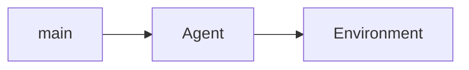
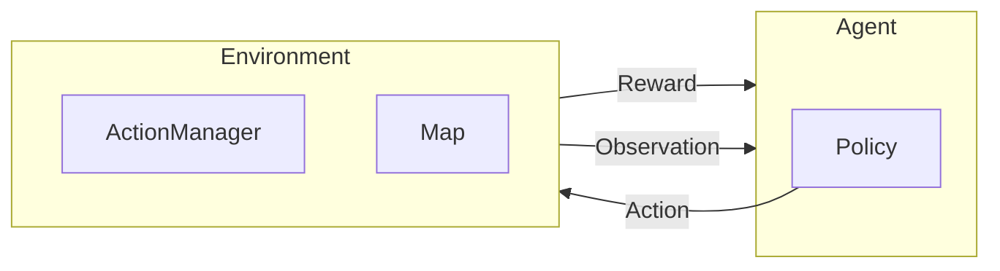

# setup

if both repos are only local
```bash
pip install -e /path/to/other/repo
```

# Civ Sim

## Game Rules

### Claiming tiles
- a tile can only be claimed if it is visible
- a tile can only be claimed if it is not already claimed
- a tile can only be claimed if it is adjacent to a claimed tile or a building not including roads and bridges

### Buildings
#### Roads
- must be placed on an already self claimed tile
- or next to another building including roads and bridges
- only placeable on: normal Land, Dessert and Marsh

#### Bridge
- must be placed on an already self claimed tile
- or next to another building including roads and bridges
  - only placeable on: normal Ocean and River

#### City
- can only be placed on a visible or already self claimed tiles
- placing a city claims the tile
- only placeable on: normal Land, Dessert and Marsh

#### Farm
- can only be placed on an already self claimed tile
- only placeable on: normal Land and Marsh

#### Mine
- can only be placed on an already self claimed tile
- only placable on Mountain or resource


# TODO

## RL Setup
- [ ] Integrartion with PufferLib
- [ ] Optimized for RL, Cython?, JAX?
- [ ] should be playable by human against his created agents


## Utils
- [ ] write profiler script for memory and time for different map sizes and agent counts-> write to a file/ table, maybe markdown?
- [ ] map previewer for a map topology file, with matplotlib

## Map
- [ ] extend map generator script to create maps of different settings
- [ ] create some maps with different sizes and different land type and resource distributions
  - [ ] add some resources

- graph representation of roads

- make importance editable water over mountain over dessert
-  enable distribution method
- add resources
-  make the distribution density and type editable
- add river water adjacent type, based on perlin noise with meandering
- enable actual biomes
- make height relevant for water and mountain
- loading maps into env


## RL

- [ ] make some kind of run setup to run on the different maps of different settings and logg

### Observation
- [ ] different types of observability for different agents
- [ ] adjust height, biomes and other min and max values in obs space
  - [ ] add option for continuos map
- [ ]!! define when done or truncated

### Rewards
- [ ] calculate rewards better, decide what rewards to give


### Actions
- [ ] account for continuous maps in action checks
- [ ] add Mine with resource extraction
        # right now all actions have a position
        # might have to adapt this later

## UI
- [ ] zooming, moving?
- [ ] Better Game termination log, why did it terminate?, which round?

- [ ] better logging for other agents, what actions they choose
- [ ] City ID connected to city owner?


## Dev Ops
- [ ] move stuff to cython
- [ ] optimize for GPU, cuda
- [ ] add more tests, increase coverage
- [ ] add more scenario tests
- [ ] scaling tests, on predefined test map, small and large scale, by map size and agent count
- [ ] documentation!!
- [ ] think about package API access, which attributes of env and which methods, funcitons, objects should be accessible

## Far fetched
- [ ] tech tree, some actions only possible if reached a level
- [ ] Population
- [ ] Tech tree
- [ ] Units
- [ ] Diplomacy
- [ ] Combat

# Mind Map





# Resources

## interesting tools and repos

* https://terrain.party/
* https://godotengine.org/asset-library/asset/1913
* https://github.com/Mindwerks/plate-tectonics
* https://github.com/Mindwerks/worldengine
* https://github.com/jessvb/3D_world_procedural_generation_GAN/blob/master/README.md
* http://www-cs-students.stanford.edu/~amitp/game-programming/polygon-map-generation/
* https://www.redblobgames.com/maps/mapgen4/
* https://www.redblobgames.com/x/1929-voronoi-percolation/

### intersting research
* https://www.instructables.com/Converting-Map-Height-Data-Into-3D-Tiles/
* https://www.mit.edu/~jessicav/6.S198/Blog_Post/ProceduralGeneration.html

## coding tools

* https://neptune.ai/blog/tensorboard-tutorial

# Bugs

- [ ] if bug with pyopengl for rendering you might need to do this: https://programmersought.com/article/82837518484/
- [ ] if error with rendering accessing the libGL error MESA-LOADER  failed to open iris driver try this command 'conda install -c conda-forge libstdcxx-ng', more info here: https://stackoverflow.com/questions/72110384/libgl-error-mesa-loader-failed-to-open-iris
-
