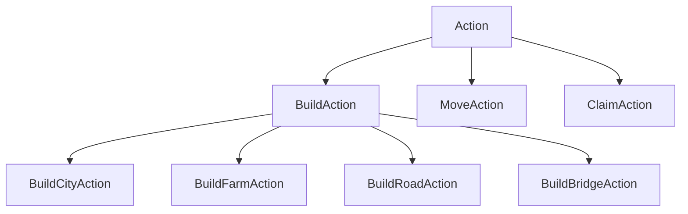

```mermaid
graph TD
    A[Action] --> B[BuildAction]
    A --> M[MoveAction]
    A --> G[ClaimAction]
    B --> C[BuildCityAction]
    B --> D[BuildFarmAction]
    B --> E[BuildRoadAction]
    B --> F[BuildBridgeAction]

```
